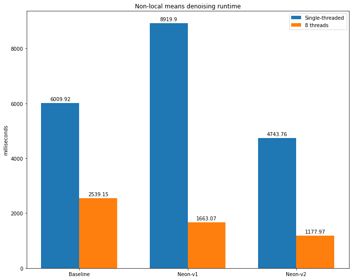

## Non Local Means Denoising using Arm Neon Intrinsics
---

### Background

- Algorithm

    Let $u(p)$ be the intensity of the image at pixel $p$. We define $\hat{u}(p)$, the denoised pixel intensity at $p$ to be,

    $$\hat{u}(p) = \frac{1}{C(p)}\sum_{q\in B(p,N)} u(q)w(p,q), \qquad C(p) = \sum_{q\in B(p,N)} w(p,q)$$

    where $B(p,N)$ indicates a neighborhood centered at $p$ and with size $(2N+1)\times(2N+1)$ pixels.

    <br>

    The weight $w(p,q)$ depends on the squared Euclidean distance $d^2$ of the $(2K+1)\times(2K+1)$ patches centered respectively at $p$ and $q$

    $$d^2(B(p,K),B(q,K)) = \frac{1}{(2K+1)^2} \sum_{i\in B(0,K)} (u(p+i) - u(q+i))^2$$

    $$w(p,q) = e^{-\frac{d^2}{h^2}}$$

    we used an exponential kernel to compute the weight as shown above, where $h$ is the filtering parameter.

    <br>

    For a `128 x 128` pixel 8-bit image scaled to single floating point, $u(p) \in [0,1.0]$, 

    <div style='text-align:center'></div>

    We apply gaussian noise of sigma = `0.2`, to generate a noisy image:

    <div style='text-align:center'></div>

    Using Non Local Means Denoising with the parameters shown below,

    - `N` = 9
    - `K` = 3
    - `h` = 0.2

    the denoised output of the noisy image is as shown below:

    <div style='text-align:center'></div>

---

### Dependencies

- CMake $\geq$ 3.22
- clang++ $\geq$ 14.0.6
- OpenMP $\geq$ 5.0
- ANDROID_VERSION $\geq$ 19.0
- ANDROID_ARCH_ABI == arm64-v8a

---

### How to build

Replace the `<android-ndk-clang++>` placeholder below with the path to your Android NDK `clang++` executable.

```shell
$ git clone https://github.com/raymondngiam/non-local-means-denoising-neon.git
$ cd non-local-means-denoising-neon
$ mkdir build && cd build
$ cmake .. -DCMAKE_CXX_COMPILER=<android-ndk-clang++> -DCMAKE_BUILD_TYPE=Debug
$ make
```

---

### How to run


- SIMD vectorization

    - To run the baseline implementation **without SIMD intrinsic optimization, with a single thread**, run the executable `nlm_denoise` with a single argument, `0` or any integer $\notin$ {`1`,`2`}.

        ```shell
        $ ./nlm_denoise 0                                        
        Unoptimized version
        Loading image of shape 128[Height] x 128[Width]
        Data loaded [16384 bytes]
        Image loaded
        Running nlm_unoptimized:
        Thread count [1]
        Execution time =6009.92 milliseconds
        ```

    - To run the implementation **with Neon intrinsic optimization v1, with a single thread**, run the executable `nlm_denoise` with a single argument, `1`.

        ```shell
        $ ./nlm_denoise 1                                        
        Neon optimized v1
        Loading image of shape 128[Height] x 128[Width]
        Data loaded [16384 bytes]
        Image loaded
        Running nlm_neon:
        Thread count [1]
        Execution time =8919.9 milliseconds
        ```

    - To run the implementation **with Neon intrinsic optimization v2, with a single thread**, run the executable `nlm_denoise` with a single argument, `2`.

        ```shell
        $ ./nlm_denoise 2                                        
        Neon optimized v2 - Fixed K
        Loading image of shape 128[Height] x 128[Width]
        Data loaded [16384 bytes]
        Image loaded
        Running nlm_neon_fixed_k:
        Thread count [1]
        Execution time =4743.76 milliseconds
        ```

- OpenMP parallel for loop

    - To run the baseline implementation **without SIMD intrinsic optimization, with OpenMP parallel for loop**, run the executable `nlm_denoise` with first argument = `0`, plus an arbitrary second argument.

        ```shell
        $ ./nlm_denoise 0 1                                      
        Unoptimized version
        Loading image of shape 128[Height] x 128[Width]
        Data loaded [16384 bytes]
        Image loaded
        Running nlm_unoptimized:
        Thread count [8]
        Execution time =2539.15 milliseconds
        ```

    - To run the implementation **with Neon intrinsic optimization v1, with OpenMP parallel for loop**, run the executable `nlm_denoise` with first argument = `1`, plus an arbitrary second argument.

        ```shell
        $ ./nlm_denoise 1 1                                      
        Neon optimized v1
        Loading image of shape 128[Height] x 128[Width]
        Data loaded [16384 bytes]
        Image loaded
        Running nlm_neon:
        Thread count [8]
        Execution time =1663.07 milliseconds
        ```

    - To run the implementation **with Neon intrinsic optimization v2, with OpenMP parallel for loop**, run the executable `nlm_denoise` with first argument = `2`, plus an arbitrary second argument.

        ```shell
        $ ./nlm_denoise 2 1                                      
        Neon optimized v2 - Fixed K
        Loading image of shape 128[Height] x 128[Width]
        Data loaded [16384 bytes]
        Image loaded
        Running nlm_neon_fixed_k:
        Thread count [8]
        Execution time =1177.97 milliseconds
        ```

---

### Result

<b>Single threaded:</b>

|Configuration|Time (milliseconds)|
|:-:|:-:|
|Baseline|6009.92|
|Neon intrinsic optimization v1|8919.90|
|Neon intrinsic optimization v2|4743.76|

<b>Multithreaded threaded (OpenMP parallel for):</b>

|Configuration|Time (milliseconds)|
|:-:|:-:|
|Baseline|2539.15|
|Neon intrinsic optimization v1|1663.07|
|Neon intrinsic optimization v2|1177.97|



---

### Implementation details

- Inner block implementation

    - Baseline

        <br>

        Line 198-231 in <a href=./main.cpp>main.cpp</a>:
        
        ```c++
        void nlm_unoptimized(int N,
                            int K,
                            float h,
                            int padLen,
                            int threadCount,
                            const Image<float> &padded,
                            Image<float> &output,
                            Image<float> &C) {
            int kernelArea = (2*K+1)*(2*K+1);
            float hSquared = h*h;
            std::cout<<"Thread count ["<<threadCount<<"]\n";
        #pragma omp parallel for num_threads(threadCount)
            for (int y = 0; y < output.height; y++) {
                for (int x = 0; x < output.width; x++) {
                    for (int ny = -N; ny < N+1; ny++) {
                        for (int nx = -N; nx < N+1; nx++) {
                            float ssd = 0.f;
                            for (int ky = -K; ky < K + 1; ky++) {
                                for (int kx = -K; kx < K + 1; kx++) {
                                    float diff;
                                    diff = padded.data[(padLen + y + ny + ky) + (padLen + x + nx + kx) * padded.height] -
                                            padded.data[(padLen + y + ky) + (padLen + x + kx) * padded.height];
                                    ssd += (diff * diff);
                                }
                            }
                            float dSquared = ssd/kernelArea;
                            float ex = std::exp(-dSquared/hSquared);
                            C.data[y + x*C.height] += ex;
                            output.data[y + x*output.height] += ex*padded.data[(padLen+y+ny) + (padLen+x+nx)*padded.height];
                        }
                    }
                }
            }
        }
        ```

    <br>

    - Neon intrinsic optimized version

        Based on the baseline implementation, we vectorize the innermost loops corresponding to the kernel convolution operations on a specific neighborhood pixel `(y+ny,x+nx)`, to compute the sum squared distance, `ssd`.

        $$ssd = \sum_{i\in B(0,K)} (u(p+i) - u(q+i))^2$$ 

        Here we iterate only along the x-axis of the kernel. At each iteration, processing `(2*K)+1` contiguous elements along the y-axis (since our image data structure is in `row-major order`).

        <br>
        
        Line 233-285 in <a href=./main.cpp>main.cpp</a>:

        ```c++
        template <bool fixedK>
        void nlm_neon(int N,
                    int K,
                    float h,
                    int padLen,
                    int threadCount,
                    const Image<float> &padded,
                    Image<float> &output,
                    Image<float> &C){
            int kernelWidth = 2*K+1;
            int kernelArea = kernelWidth*kernelWidth;
            float hSquared = h*h;
            std::cout<<"Thread count ["<<threadCount<<"]\n";
        #pragma omp parallel for num_threads(threadCount)
            for (int y = 0; y < output.height; y++) {
                for (int x = 0; x < output.width; x++) {
                    for (int ny = -N; ny < N+1; ny++) {
                        for (int nx = -N; nx < N+1; nx++) {
                            float ssd = 0.f;
                            float32x4_t vec128 = vdupq_n_f32(0.0); // clear accumulators
                            // for kernel convolution, we iterate along the x-axis only,
                            // at each iteration, process (2*K)+1 contiguous elements along y-axis
                            for (int kx = -K; kx < K + 1; kx++) {
                                int refIndex = (padLen + y + ny) + (padLen + x + nx + kx) * padded.height;
                                int kernelIndex = (padLen + y) + (padLen + x + kx) * padded.height;
                                if (fixedK){
                                    ssd_reduce_K3(vec128, padded.data.data()+kernelIndex, padded.data.data()+refIndex);
                                }
                                else{
                                    ssd += ssd_reduce(padded.data.data()+kernelIndex, padded.data.data()+refIndex, kernelWidth);
                                }

                            }
                            // perform the summation of the accumulator only once
                            if (fixedK){
                                float32x2_t vec64a, vec64b;
                                vec64a = vget_low_f32(vec128); // split 128-bit vector

                                vec64b = vget_high_f32(vec128); // into two 64-bit vectors

                                vec64a = vadd_f32 (vec64a, vec64b); // add 64-bit vectors together

                                ssd = vget_lane_f32(vec64a, 0) + vget_lane_f32(vec64a, 1);
                            }
                            float dSquared = ssd/kernelArea;
                            float ex = std::exp(-dSquared/hSquared);
                            C.data[y + x*C.height] += ex;
                            output.data[y + x*output.height] += ex*padded.data[(padLen+y+ny) + (padLen+x+nx)*padded.height];
                        }
                    }
                }
            }
        }
        ```

        When `fixedK` = `false`, `Neon intrinsic optimization v1` will be executed.
        
        When `fixedK` = `true`, `Neon intrinsic optimization v2` will be executed.

        <br>

- The different variations of the inner block implementation shown above, produce arrays `output` and `C`.

    Given the denoise image is expressed as:

    $$\hat{u}(p) = \frac{1}{C(p)}\sum_{q\in B(p,N)} u(q)w(p,q)$$

    Here, the `output` array corresponds to the weighted sum term:

    $$\sum_{q\in B(p,N)} u(q)w(p,q)$$

    Thus in order the generate the final denoised image, `result`, we execute the following transformation:

    <br>
        
    Line 178-186 in <a href=./main.cpp>main.cpp</a>:

    ```c++
    Image<uint8_t> result(im.height,im.width);
    std::transform (
            output.data.begin(),
            output.data.end(),
            B.data.begin(),
            result.data.begin(),
            [](auto i, auto j){
                return std::floor(i/j*255.0);
            });

    ```

- Details on Neon intrinsics optimization

    - `Neon intrinsic optimization v1`

        Using the Neon intrinsics, we can perform arithmetic operations with four `float` (32-bit) elements in a single instruction.

        In essence, the utility function `ssd_reduce` shown below, performs the `ssd` reduction along a single dimension, with contiguous memory allocation (i.e. in this particular use case: along the y-axis of the convolution kernel). 
        
        <br>
            
        Line 287-344 in <a href=./main.cpp>main.cpp</a>:
        
        ```cpp
        const int SIMD_MULTPLE = 4;

        // neon simd utility function
        float ssd_reduce(const float* ptrA, const float* ptrB, uint32_t count) {
            int remainder = count % SIMD_MULTPLE;
            int fullLoopCount = count/SIMD_MULTPLE; //floor
            int fullLoopEnd = (fullLoopCount-1)*SIMD_MULTPLE ;

            float32x2_t vec64a, vec64b;
            float32x4_t vec128 = vdupq_n_f32(0.0); // clear accumulators
            float32x4_t vecA, vecB;

            // full stride, contiguous memory access loop
            for (int i = 0; i <= fullLoopEnd; i+=SIMD_MULTPLE) {
                vecA = vld1q_f32(ptrA+i); // load four 32-bit values
                vecB = vld1q_f32(ptrB+i); // load four 32-bit values
                float32x4_t diff = vsubq_f32(vecA,vecB);
                float32x4_t squared = vmulq_f32(diff,diff);
                vec128=vaddq_f32(vec128, squared); // accumulate the squared_diff
            }
            // remainder loop
            if(remainder != 0){
                int remainderFirstElement = (fullLoopCount)*SIMD_MULTPLE;
                vecA = vld1q_f32(ptrA+remainderFirstElement); // load four 32-bit values
                vecB = vld1q_f32(ptrB+remainderFirstElement); // load four 32-bit values

                // set remainder to 0
                switch (SIMD_MULTPLE - remainder) {
                    case 3:
                        vsetq_lane_f32(0,vecA,1);
                        vsetq_lane_f32(0,vecB,1);
                    case 2:
                        vsetq_lane_f32(0,vecA,2);
                        vsetq_lane_f32(0,vecB,2);
                    case 1:
                    default:
                        vsetq_lane_f32(0,vecA,3);
                        vsetq_lane_f32(0,vecB,3);
                        break;
                }

                float32x4_t diff = vsubq_f32(vecA,vecB);
                float32x4_t squared = vmulq_f32(diff,diff);
                vec128=vaddq_f32(vec128, squared); // accumulate the squared_diff

            }
            vec64a = vget_low_f32(vec128); // split 128-bit vector

            vec64b = vget_high_f32(vec128); // into two 64-bit vectors

            vec64a = vadd_f32 (vec64a, vec64b); // add 64-bit vectors together

            float result = vget_lane_f32(vec64a, 0); // extract lanes and

            result += vget_lane_f32(vec64a, 1); // add together scalars

            return result;
        }
        ```

    - `Neon intrinsic optimization v2`

        Building on the foundation of `Neon intrinsic optimization v1`:
        
        1. we replace the two instructions, namely `vmulq_f32`(multiplication) and `vaddq_f32`(addition) with a single instruction, `vmlaq_f32`(multiply-accumulate).

            <b>Before:</b>

            ```c++
            float32x4_t diff = vsubq_f32(vecA,vecB);
            float32x4_t squared = vmulq_f32(diff,diff);
            vec128=vaddq_f32(vec128, squared); // accumulate the squared_diff
            ```

            <b>After:</b>

            ```c++
            float32x4_t diff = vsubq_f32(vecA,vecB);        
            vec128 = vmlaq_f32(vec128, diff, diff); // multiply-accumulate the diff
            ```
        1. by fixing `K` to be constant, we remove the condition checking for remainder loop.

        1. by making the `vec128` accumulator a common global variable shared among all the column-wise 1-d convolutions, and perform the summation of the accumulator only once (for every instance of 2d kernel convolution).

        <br>

        The implementation of the utility function, `ssd_reduce_K3` is as shown below:

        <br>
            
        Line 346-374 in <a href=./main.cpp>main.cpp</a>:

        ```c++
        const int K3_COUNT = 7; // K=3; count=2*K+1
        const int K3_FULL_LOOP_COUNT = K3_COUNT/SIMD_MULTPLE; //floor
        const int K3_FULL_LOOP_END = (K3_FULL_LOOP_COUNT-1)*SIMD_MULTPLE;
        const int K3_REMAINDER_LOOP_START = (K3_FULL_LOOP_COUNT)*SIMD_MULTPLE;

        void ssd_reduce_K3(float32x4_t& vec128, const float* ptrA, const float* ptrB) {
            float32x4_t vecA, vecB;

            // full stride, contiguous memory access loop
            for (int i = 0; i <= K3_FULL_LOOP_END; i+=SIMD_MULTPLE) {
                vecA = vld1q_f32(ptrA+i); // load four 32-bit values
                vecB = vld1q_f32(ptrB+i); // load four 32-bit values
                float32x4_t diff = vsubq_f32(vecA,vecB);
                vec128 = vmlaq_f32(vec128, diff, diff); // multiply-accumulate the diff
            }

            // Load remainder loop
            vecA = vld1q_f32(ptrA+K3_REMAINDER_LOOP_START); // load four 32-bit values
            vecB = vld1q_f32(ptrB+K3_REMAINDER_LOOP_START); // load four 32-bit values

            // remainder = K3_COUNT % SIMD_MULTPLE = 7 % 4 = 3
            // SIMD_MULTPLE - remainder = 4 - 3 = 1
            // we need to set the last lane to 0
            vsetq_lane_f32(0,vecA,3);
            vsetq_lane_f32(0,vecB,3);

            float32x4_t diff = vsubq_f32(vecA,vecB);
            vec128 = vmlaq_f32(vec128, diff, diff); // multiply-accumulate the diff
        }
        ```

#### References

1. Antoni Buades, Bartomeu Coll, and Jean-Michel Morel, Non-Local Means Denoising, Image Processing On Line, 1 (2011), pp. 208–212. https://doi.org/10.5201/ipol.2011.bcm_nlm